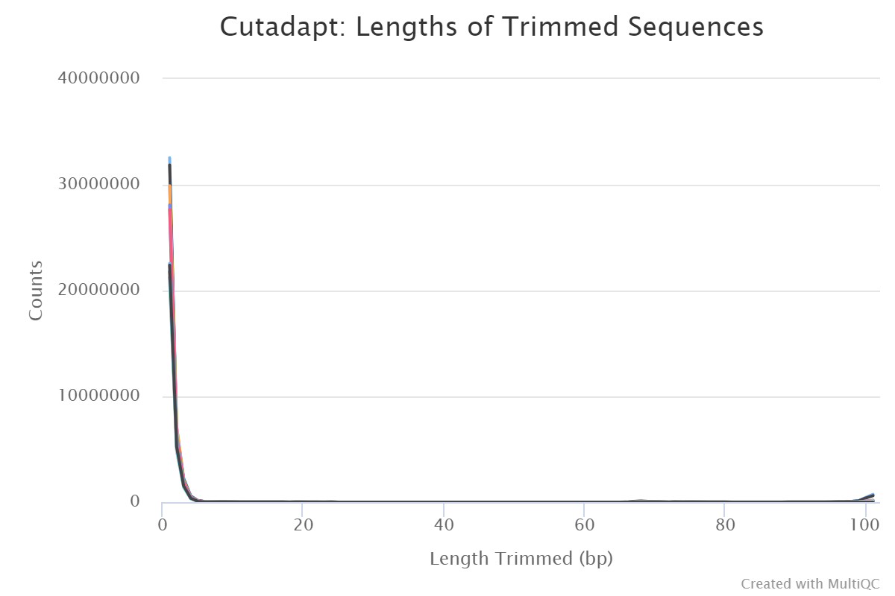
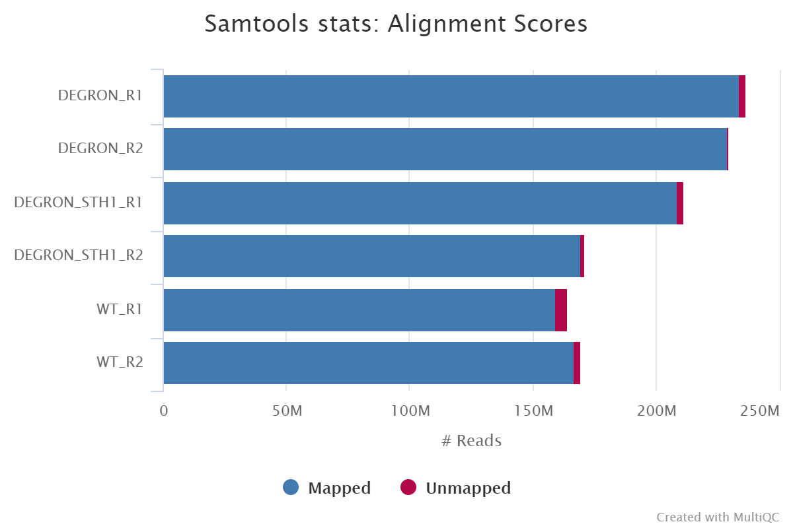
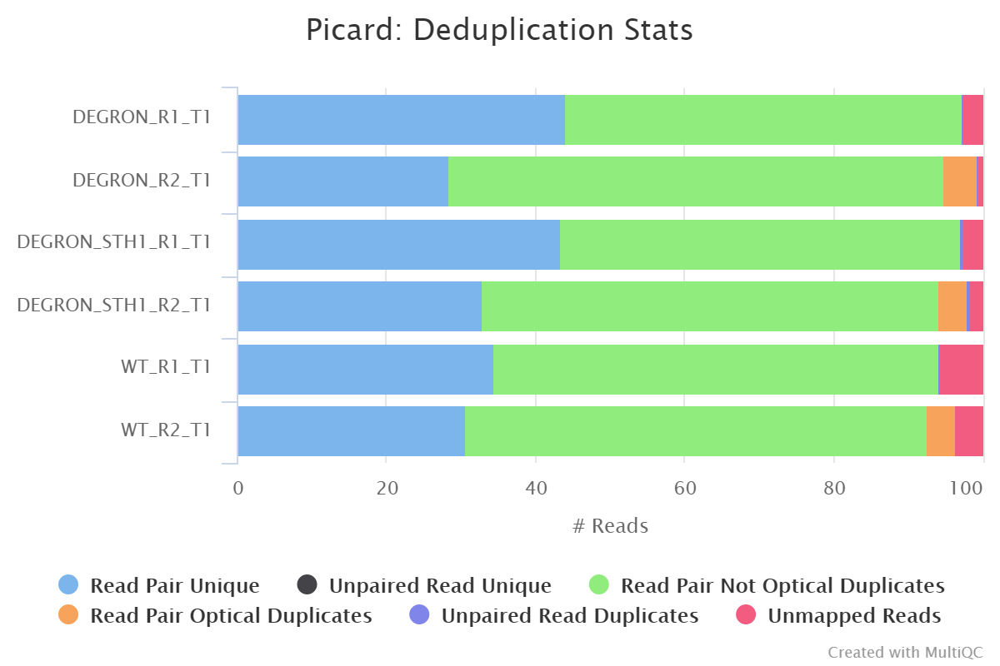
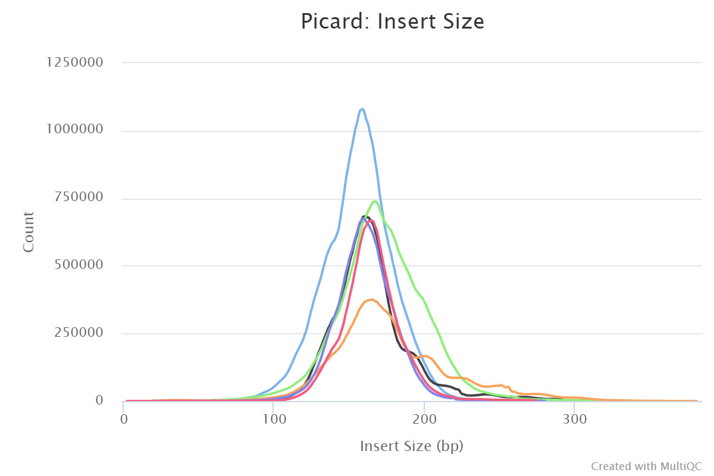
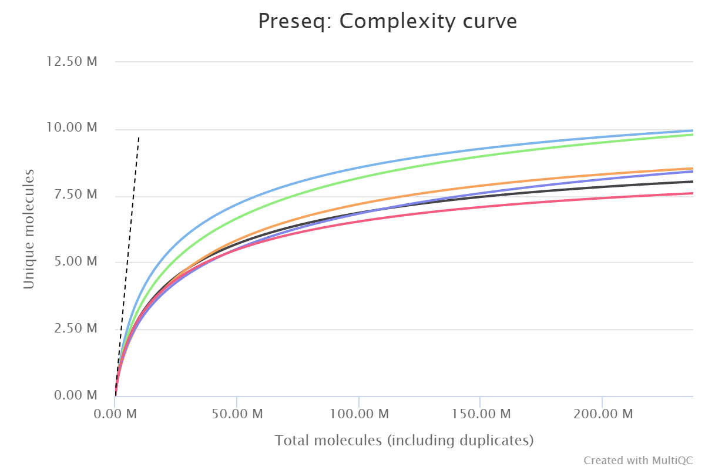
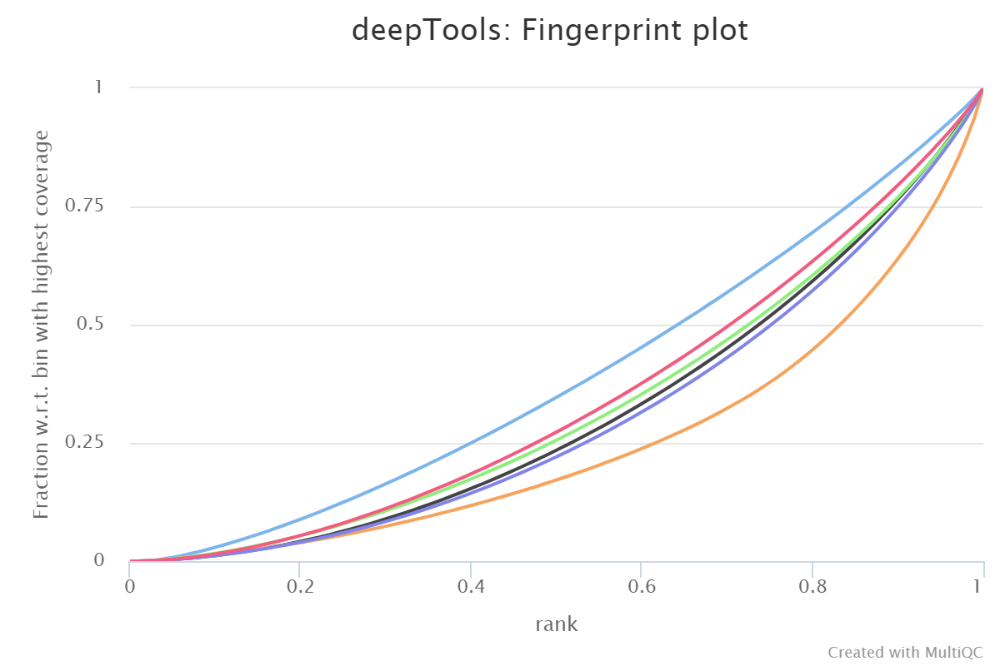
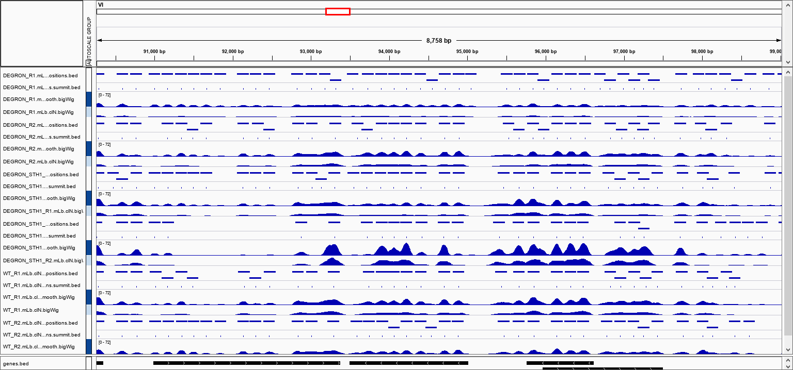

# nf-core/mnaseseq: Output

This document describes the output produced by the pipeline. Most of the plots are taken from the MultiQC report, which summarises results at the end of the pipeline.

## Pipeline overview
The pipeline is built using [Nextflow](https://www.nextflow.io/). See [`main README.md`](../README.md) for a condensed overview of the steps in the pipeline, and the bioinformatics tools used at each step.

See [Illumina website](https://emea.illumina.com/science/sequencing-method-explorer/kits-and-arrays/maine-seq-mnase-seq-nucleo-seq.html) for more information regarding the MNase-seq protocol, and for an extensive list of publications.

The directories listed below will be created in the output directory after the pipeline has finished. All paths are relative to the top-level results directory.

## Library-level analysis

The initial QC and alignments are performed at the library-level e.g. if the same library has been sequenced more than once to increase sequencing depth. This has the advantage of being able to assess each library individually, and the ability to process multiple libraries from the same sample in parallel.

1. **Raw read QC**

    *Documentation*:  
    [FastQC](http://www.bioinformatics.babraham.ac.uk/projects/fastqc/Help/)  

    *Description*:  
    FastQC gives general quality metrics about your reads. It provides information about the quality score distribution across your reads, the per base sequence content (%A/C/G/T). You get information about adapter contamination and other overrepresented sequences.  

    *Output directories*:  
    * `fastqc/`  
    FastQC `*.html` files for read 1 (*and read2 if paired-end*) **before** adapter trimming.  
    * `fastqc/zips/`  
    FastQC `*.zip` files for read 1 (*and read2 if paired-end*) **before** adapter trimming.  

2. **Adapter trimming**

    *Documentation*:  
    [Trim Galore!](https://www.bioinformatics.babraham.ac.uk/projects/trim_galore/)

    *Description*:  
    Trim Galore! is a wrapper tool around Cutadapt and FastQC to consistently apply quality and adapter trimming to FastQ files. By default, Trim Galore! will automatically detect and trim the appropriate adapter sequence. See [`usage.md`](usage.md) for more details about the trimming options.

    

    *Output directories*:
    * `trim_galore/`  
      If `--saveTrimmed` is specified FastQ files **after** adapter trimming will be placed in this directory.
    * `trim_galore/logs/`  
      `*.log` files generated by Trim Galore!.
    * `trim_galore/fastqc/`  
      FastQC `*.html` files for read 1 (*and read2 if paired-end*) **after** adapter trimming.
    * `trim_galore/fastqc/zips/`  
      FastQC `*.zip` files for read 1 (*and read2 if paired-end*) **after** adapter trimming.

3. **Alignment**

    *Documentation*:  
    [BWA](http://bio-bwa.sourceforge.net/bwa.shtml), [SAMtools](http://samtools.sourceforge.net/)

    *Description*:  
    Adapter-trimmed reads are mapped to the reference assembly using BWA. A genome index is required to run BWA so if this is not provided explicitly using the `--bwa_index` parameter then it will be created automatically from the genome fasta input. The index creation process can take a while for larger genomes so it is possible to use the `--saveGenomeIndex` parameter to save the indices for future pipeline runs, reducing processing times.

    

    File names in the resulting directory (i.e. `bwa/library/`) will have the '`.Lb.`' (**L**i**b**rary) suffix.

    *Output directories*:
    * `bwa/library/`  
      The files resulting from the alignment of individual libraries are not saved by default so this directory will not be present in your results. You can override this behaviour with the use of the `--saveAlignedIntermediates` flag in which case it will contain the coordinate sorted alignment files in [`*.bam`](https://samtools.github.io/hts-specs/SAMv1.pdf) format.
    * `bwa/library/samtools_stats/`  
      SAMtools `*.flagstat`, `*.idxstats` and `*.stats` files generated from the alignment files.

## Merged library-level analysis

The library-level alignments associated with the same sample are merged and subsequently used for the downstream analyses.

1. **Alignment merging, duplicate marking, filtering and QC**

    *Documentation*:  
    [picard](https://broadinstitute.github.io/picard/command-line-overview.html), [SAMtools](http://samtools.sourceforge.net/), [BEDTools](https://bedtools.readthedocs.io/en/latest/), [BAMTools](https://github.com/pezmaster31/bamtools/wiki/Tutorial_Toolkit_BamTools-1.0.pdf), [Pysam](https://pysam.readthedocs.io/en/latest/api.html), [Preseq](http://smithlabresearch.org/software/preseq/)

    *Description*:  
    Picard MergeSamFiles and MarkDuplicates are used in combination to merge the alignments, and for the marking of duplicates, respectively. If you only have one library for any given replicate then the merging step isnt carried out because the library-level and merged library-level BAM files will be exactly the same.

    Read duplicate marking is carried out using the Picard MarkDuplicates command. Duplicate reads are generally removed from the aligned reads to mitigate for fragments in the library that may have been sequenced more than once due to PCR biases. There is an option to keep duplicate reads with the `--keepDups` parameter but its generally recommended to remove them to avoid the wrong interpretation of the results. A similar option has been provided to keep reads that are multi-mapped - `--keepMultiMap`. Other steps have been incorporated into the pipeline to filter the resulting alignments - see [`main README.md`](../README.md) for a more comprehensive listing, and the tools used at each step.

    A selection of alignment-based QC metrics generated by Picard CollectMultipleMetrics and MarkDuplicates will be included in the MultiQC report.

    

      

    The Preseq package is aimed at predicting and estimating the complexity of a genomic sequencing library, equivalent to predicting and estimating the number of redundant reads from a given sequencing depth and how many will be expected from additional sequencing using an initial sequencing experiment. The estimates can then be used to examine the utility of further sequencing, optimize the sequencing depth, or to screen multiple libraries to avoid low complexity samples. The dashed line shows a perfectly complex library where total reads = unique reads.

    Note that these are predictive numbers only, not absolute. The MultiQC plot can sometimes give extreme sequencing depth on the X axis - click and drag from the left side of the plot to zoom in on more realistic numbers.

      

    File names in the resulting directory (i.e. `bwa/mergedLibrary/`) will have the '`.mLb.`' suffix to denote **m**erged **L**i**b**raries.

    *Output directories*:
    * `bwa/mergedLibrary/`  
      Merged library-level, coordinate sorted `*.bam` files after the marking of duplicates, and filtering based on various criteria. The file suffix for the final filtered files will be `*.mLb.clN.*`. If you specify the `--saveAlignedIntermediates` parameter then two additional sets of files will be present. These represent the unfiltered alignments with duplicates marked (`*.mLb.mkD.*`), and in the case of paired-end datasets the filtered alignments before the removal of orphan read pairs (`*.mLb.flT.*`).
    * `bwa/mergedLibrary/samtools_stats/`  
      SAMtools `*.flagstat`, `*.idxstats` and `*.stats` files generated from the alignment files.
    * `bwa/mergedLibrary/picard_metrics/`  
      Alignment QC files from picard CollectMultipleMetrics and the metrics file from MarkDuplicates: `*_metrics` and `*.metrics.txt`, respectively. These are generated both *before* (`*.mLb.mkD.*`) and *after* (`*.mLb.clN.*`) read filtering.
    * `bwa/mergedLibrary/picard_metrics/pdf/`  
      Alignment QC plot files in `*.pdf` format from picard CollectMultipleMetrics.
    * `bwa/mergedLibrary/preseq/`  
      Preseq expected future yield file (`*.ccurve.txt`).

2. **Normalised bigWig files**

    *Documentation*:  
    [BEDTools](https://bedtools.readthedocs.io/en/latest/), [bedGraphToBigWig](https://genome.ucsc.edu/goldenpath/help/bigWig.html#Ex3)  

    *Description*:  
    The [bigWig](https://genome.ucsc.edu/goldenpath/help/bigWig.html) format is in an indexed binary format useful for displaying dense, continuous data in Genome Browsers such as the [UCSC](https://genome.ucsc.edu/cgi-bin/hgTracks) and [IGV](http://software.broadinstitute.org/software/igv/). This mitigates the need to load the much larger BAM files for data visualisation purposes which will be slower and result in memory issues. The coverage values represented in the bigWig file can also be normalised in order to be able to compare the coverage across multiple samples - this is not possible with BAM files. The bigWig format is also supported by various bioinformatics software for downstream processing such as meta-profile plotting.

    *Output directories*:
    * `bwa/mergedLibrary/bigwig/`  
      Normalised `*.bigWig` files scaled to 1 million mapped reads.

3. **MNase-seq QC metrics**

    *Documentation*:  
    [deepTools](https://deeptools.readthedocs.io/en/develop/content/list_of_tools.html)

    *Description*:  
    deepTools plotFingerprint is a useful QC for MNase-seq data in order to see the relative enrichment of the samples on a genome-wide basis (see [plotFingerprint docs](https://deeptools.readthedocs.io/en/develop/content/tools/plotFingerprint.html)).

      

    The results from deepTools plotProfile gives you a quick visualisation for the genome-wide enrichment of your samples at the TSS. During the downstream analysis, you may want to refine the features/genes used to generate these plots in order to see a more specific condition-related effect.

    *Output directories*:
    * `bwa/mergedLibrary/deepTools/plotFingerprint/`  
      `*.plotFingerprint.pdf`, `*.plotFingerprint.qcmetrics.txt`, `*.plotFingerprint.raw.txt`
    * `bwa/mergedLibrary/deepTools/plotProfile/`  
      `*.computeMatrix.mat.gz`, `*.computeMatrix.vals.mat.gz`, `*.plotProfile.pdf`, `*.plotProfile.tab`.

4. **Nucleosome profiling**

    *Documentation*:  
    [DANPOS2](https://sites.google.com/site/danposdoc/home/dpos)

    *Description*:  
    The DANPOS2 `dpos` tool is used by the pipeline in order to analyse the fuzziness and occupancy at each nucleosome. The tool generates a smoothed `bigWig` file normalised to 1 million reads that can also be used downstream by tools such as `deepTools` to plot average occupancy profiles across regions of interest.

    *Output directories*:
    * `bwa/mergedLibrary/danpos/`  
      * Normalised and smoothed `*.bigWig` files scaled to 1 million reads.  
      * `.xls` file containing nucleosome position information.  
      * BED files containing nucleosome positions (`*.bed`) and summit information (`*.summit.bed`).  

## Aggregate analysis

1. **Present QC for the raw read, alignment, peak and differential binding results**

    *Documentation*:  
    [MultiQC](https://multiqc.info/docs/)

    *Description*:  
    MultiQC is a visualisation tool that generates a single HTML report summarising all samples in your project. Most of the pipeline QC results are visualised in the report and further statistics are available within the report data directory.  

    Results generated by MultiQC collate pipeline QC from FastQC, TrimGalore, samtools flagstat, samtools idxstats, samtools stats, picard CollectMultipleMetrics, picard MarkDuplicates, Preseq and deepTools plotFingerprint (see [`multiqc config file`](../assets/multiqc_config.yaml)).  

    The pipeline has special steps which also allow the software versions to be reported in the MultiQC output for future traceability. For more information about how to use MultiQC reports, see <http://multiqc.info>.

    *Output directories*:
    * `multiqc/`  
      * `multiqc_report.html` - a standalone HTML file that can be viewed in your web browser.
      * `multiqc_data/` - directory containing parsed statistics from the different tools used in the pipeline.
      * `multiqc_plots/` - directory containing static images from the report in various formats.

2. **Create IGV session file**

    *Documentation*:  
    [IGV](https://software.broadinstitute.org/software/igv/UserGuide)

    *Description*:  
    An IGV session file will be created at the end of the pipeline containing the normalised bigWig tracks (both smoothed and unsmoothed), nucleosome positions and associated summits. This avoids having to load all of the data individually into IGV for visualisation.

    The genome fasta file required for the IGV session will be the same as the one that was provided to the pipeline. This will be copied into `reference_genome/` to overcome any loading issues. If you prefer to use another path or an in-built genome provided by IGV just change the `genome` entry in the second-line of the session file.

    The file paths in the IGV session file will only work if the results are kept in the same place on your storage. If the results are moved or for example, if you prefer to load the data over the web then just replace the file paths with others that are more appropriate.

    Once installed, open IGV, go to `File > Open Session` and select the `igv_session.xml` file for loading.

    >NB: If you are not using an in-built genome provided by IGV you will need to load the annotation yourself e.g. in .gtf and/or .bed format.

      

    *Output directories*:
    * `igv/`  
      * `igv_session.xml` file.  
      * `igv_files.txt` file containing a listing of the files used to create the IGV session, and their allocated colours.

## Other results

1. **Reference genome files**

    *Documentation*:  
    [BWA](https://sourceforge.net/projects/bio-bwa/files/), [BEDTools](https://bedtools.readthedocs.io/en/latest/), [SAMtools](http://samtools.sourceforge.net/)

    *Description*:
    Reference genome-specific files can be useful to keep for the downstream processing of the results.

    *Output directories*:
    * `reference_genome/`  
      A number of genome-specific files are generated by the pipeline in order to aid in the filtering of the data, and because they are required by standard tools such as BEDTools. These can be found in this directory along with the genome fasta file which is required by IGV.
    * `reference_genome/BWAIndex/`  
      If the `--saveGenomeIndex` parameter is provided then the alignment indices generated by the pipeline will be saved in this directory. This can be quite a time-consuming process so it permits their reuse for future runs of the pipeline or for other purposes.  

2. **Pipeline information**

    *Documentation*:  
    [Nextflow!](https://www.nextflow.io/docs/latest/tracing.html)

    *Description*:  
    Nextflow provides excellent functionality for generating various reports relevant to the running and execution of the pipeline. This will allow you to trouble-shoot errors with the running of the pipeline, and also provide you with other information such as launch commands, run times and resource usage.

    *Output directories*:
    * `pipeline_info/`  
      * Reports generated by the pipeline - `pipeline_report.html`, `pipeline_report.txt` and `software_versions.csv`.
      * Reports generated by Nextflow - `execution_report.html`, `execution_timeline.html`, `execution_trace.txt` and `pipeline_dag.svg`.
      * Reformatted design file used as input to the pipeline - `design_reads.csv`.
    * `Documentation/`  
      Documentation for interpretation of results in HTML format - `results_description.html`.
